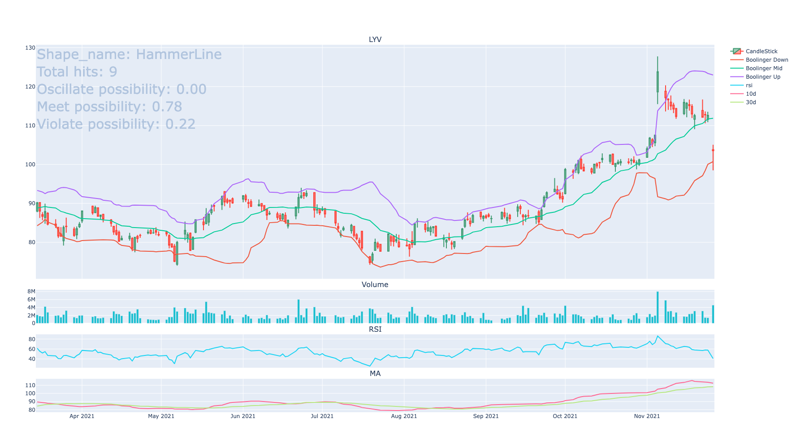

# lucky-cat
This project analyzes typical candlestick structures based on theories described in the widely known book [Japanese Candlestick Charting Techniques](https://www.amazon.com/Japanese-Candlestick-Charting-Techniques-Contemporary-ebook/dp/B00CS74GBM) by [Steve Nison](https://cmtassociation.org/presenter/steve-nison/#:~:text=Steve%20Nison%2C%20who%20was%20among,known%20Japanese%20Candlestick%20Charting%20Technique).   
When a match detected(e.g., [hammer](https://en.wikipedia.org/wiki/Hammer_(candlestick_pattern)), [meteor](https://en.wikipedia.org/wiki/Shooting_star_(candlestick_pattern))) for certain stock, it will try to predict the possibility based on history data. It will also plot trading volume, [RSI](https://en.wikipedia.org/wiki/Relative_strength_index), [MA](https://en.wikipedia.org/wiki/Moving_average), [Booliner Bands](https://en.wikipedia.org/wiki/Bollinger_Bands) to help make decisions.   
It can save us a lot of time by using predefined algorithms to filter out stocks we are interested in instead of manually checking them one by one. We already provide support to get all symbols for some popular indexes(e.g., [Nasdaq-100](https://en.wikipedia.org/wiki/Nasdaq-100), [S&P 500](https://en.wikipedia.org/wiki/S%26P_500), [DJIA](https://en.wikipedia.org/wiki/Dow_Jones_Industrial_Average)).

## Tools used in this project
* Use [Poetry](https://python-poetry.org/) to managed package dependency.
* Use [MySQL](https://www.mysql.com/) database to store trading histories & use [alembic](https://alembic.sqlalchemy.org/en/latest/) to do migration.
* Use [SQLAlchemy](https://www.sqlalchemy.org/) as an ORM tool to communicate with MySQL DB.
* Use [yFinance](https://github.com/ranaroussi/yfinance) to download history price data from [Yahoo Finance API](https://www.yahoofinanceapi.com/).
* Use [pandas](https://pandas.pydata.org/) to manipulate & analyze history data.
* Use [plotly](https://plotly.com/python/) to do data visualization.

## TODO
* Make the interface more user-friendly.
* Parallel the analyzing & predicting process to speed up
* Fully support for cryptocurrency(e.g., [BTC](https://en.wikipedia.org/wiki/Bitcoin), [ETH](https://en.wikipedia.org/wiki/Ethereum)).
* Introduce Deep Learning Model(e.g., [Reinforcement leaning](https://en.wikipedia.org/wiki/Reinforcement_learning)) to improve predicting accuracy.
